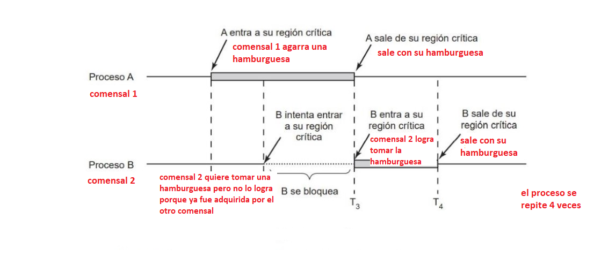

# Arquitectura y Sistemas Operativos - Micaela Zubiel
## TP1
* [Resolución](TP1/captura.png)
## TP2
* [Resolución](https://github.com/micaelazubiel/-ASO2024TPs/blob/master/TP2/Captura%20de%20pantalla%20tp2.png)
## TP3
**1) a)** El tiempo de ejecución de los programas *conhilos.py* y *sinhilos.py* es diferente. Por un lado, *conhilos.py* tiene un tiempo de ejecución más rápido ya que realiza las tareas simultáneamente (en paralelo), reduciendo el tiempo de ejecución. Por otro lado, la duración de ejecución de *sinhilos.py* es más lenta y variable, debido a que ejecuta las tareas secuencialmente, una tras otra. Cada tarea debe esperar a que la anterior se complete antes de comenzar.

**b)** Después de comparar con un compañero, se observa que los tiempos de ejecución no son iguales, pero sí similares. Las diferencias entre los tiempos son mínimas, generalmente varían solo en los decimales.

**c)** Al ejecutar el archivo *suma_resta.py* sin descomentar las líneas establecidas, el valor final siempre es 0,... y el tiempo de ejecución es relativamente rápido, no obstante, al descomentar las líneas surgió la "condición de carrera", lo cual ocurre cuando varias tareas intentan cambiar el mismo valor al mismo tiempo. Esto sucede porque no se puede prever qué tarea terminará primero, causando resultados diferentes cada vez que se ejecuta el programa.

**2) a)**
```
#include <pthread.h>
#include <stdio.h>
#include <stdlib.h>
#define NUMBER_OF_THREADS 2
#define CANTIDAD_INICIAL_HAMBURGUESAS 20
int cantidad_restante_hamburguesas = CANTIDAD_INICIAL_HAMBURGUESAS;
int turno = 0;

void *comer_hamburguesa(void *tid)
{
	while (1 == 1)
	{ 
		while(turno!=(int)tid);
    // INICIO DE LA ZONA CRÍTICA
		if (cantidad_restante_hamburguesas > 0)
		{
			printf("Hola! soy el hilo(comensal) %d , me voy a comer una hamburguesa ! ya que todavia queda/n %d \n", (int) tid, cantidad_restante_hamburguesas);
			cantidad_restante_hamburguesas--; // me como una hamburguesa
		}
		else
		{
			printf("SE TERMINARON LAS HAMBURGUESAS :( \n");

			pthread_exit(NULL); // forzar terminacion del hilo
		}
    // SALIDA DE LA ZONA CRÍTICA   
	turno = (turno + 1)% NUMBER_OF_THREADS;

	}
}

int main(int argc, char *argv[])
{
	pthread_t threads[NUMBER_OF_THREADS];
	int status, i, ret;
	for (int i = 0; i < NUMBER_OF_THREADS; i++)
	{
		printf("Hola!, soy el hilo principal. Estoy creando el hilo %d \n", i);
		status = pthread_create(&threads[i], NULL, comer_hamburguesa, (void *)i);
		if (status != 0)
		{
			printf("Algo salio mal, al crear el hilo recibi el codigo de error %d \n", status);
			exit(-1);
		}
	}

	for (i = 0; i < NUMBER_OF_THREADS; i++)
	{
		void *retval;
		ret = pthread_join(threads[i], &retval); // espero por la terminacion de los hilos que cree
	}
	pthread_exit(NULL); // como los hilos que cree ya terminaron de ejecutarse, termino yo tambien.
}
```
**b)** 

## TP4
* [Resolución]([TP1/captura.png](https://github.com/micaelazubiel/-ASO2024TPs/commit/05374c4795b0b9a1e24be06d4f0942e6ccc245b6))
